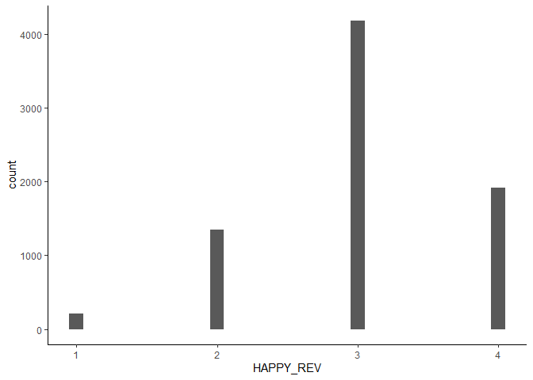

My Dataset
================
2024-09-26

``` r
# Set a CRAN mirror
options(repos = c(CRAN = "https://cran.rstudio.com/"))

# Install the nortest package
install.packages("nortest")
```

    ## Installing package into 'C:/Users/sidne/AppData/Local/R/win-library/4.4'
    ## (as 'lib' is unspecified)

    ## package 'nortest' successfully unpacked and MD5 sums checked
    ## 
    ## The downloaded binary packages are in
    ##  C:\Users\sidne\AppData\Local\Temp\RtmpSEudda\downloaded_packages

``` r
install.packages("dplyr")
```

    ## Installing package into 'C:/Users/sidne/AppData/Local/R/win-library/4.4'
    ## (as 'lib' is unspecified)

    ## package 'dplyr' successfully unpacked and MD5 sums checked
    ## 
    ## The downloaded binary packages are in
    ##  C:\Users\sidne\AppData\Local\Temp\RtmpSEudda\downloaded_packages

``` r
library(car)
```

    ## Loading required package: carData

``` r
library(dplyr) #recode variables
```

    ## 
    ## Attaching package: 'dplyr'

    ## The following object is masked from 'package:car':
    ## 
    ##     recode

    ## The following objects are masked from 'package:stats':
    ## 
    ##     filter, lag

    ## The following objects are masked from 'package:base':
    ## 
    ##     intersect, setdiff, setequal, union

``` r
#library(tidyr)
library(ggplot2)
#library(psych)
#library(bruceR)
library(haven) #load CSV

install.packages("nortest")
```

    ## Installing package into 'C:/Users/sidne/AppData/Local/R/win-library/4.4'
    ## (as 'lib' is unspecified)

    ## package 'nortest' successfully unpacked and MD5 sums checked
    ## 
    ## The downloaded binary packages are in
    ##  C:\Users\sidne\AppData\Local\Temp\RtmpSEudda\downloaded_packages

``` r
library(nortest)
#install.packages("car")
```

Reading dataset

``` r
# Set working directory
#setwd("C:/Users/sidne/OneDrive/Documents/GitHub/myproject")

# Read the TSV file
data <- read.table("C:/Users/sidne/OneDrive/Desktop/PSY329/38964-0001-Data.tsv", sep = "\t", header = TRUE, fill = TRUE, quote = "")

# Write the data to a CSV file
write.csv(data, "Excel-Data.csv", row.names = FALSE)

#open file
data <- read.csv("C:/Users/sidne/OneDrive/Desktop/PSY329/Excel-Data.csv")
```

Cleaning data set and recoding variables

``` r
clean_data <- data %>%
  select(SEX,HHINC,HAPPY,SAT1,SAT2,SAT3,SAT4,SAT5,LONELY_A,LONELY_B,LONELY_C) 

clean_data$SEX<-recode(data$SEX, '1' = 'Male', '2' = 'Female', '3'='Other')

#clean_data$RACEREC<-recode(data$RACEREC, '1'='White','2'='Black','3'='Indigenous American','4'='Hispanic','5'='Asian','6'= 'Other', '98'='Unknown') I don't think I am going to use race

clean_data$HOUSE_INCOME<-recode(data$HHINC, '1' = '<10K', '2' = '10K-24K', '3'='25k-39k','4'='40k-49k','5'='50K-59K','6'='60K-74K','7'='75K-84K','8'='85K-99K','9'='100K-124K','10'='125K-149K','11'='150K-199K','12'='200k+')
```

    ## Warning: Unreplaced values treated as NA as `.x` is not compatible.
    ## Please specify replacements exhaustively or supply `.default`.

``` r
clean_data$HAPPY_meaning<-recode(data$HAPPY, '1' = 'Very happy', '2' = 'Rather happy', '3'='Not very happy','4'='Not at all happy')

clean_data <- clean_data %>%
   mutate(Lonely=rowMeans(cbind(LONELY_A,LONELY_B,LONELY_C))) #1 hardly ever feel lonely to 5 often feel lonely 

clean_data <- clean_data %>%
  mutate(Lonely = ifelse(Lonely > 3, NA, Lonely)) #removing participants that responded don't know or refused the question

clean_data <- clean_data %>%
   mutate(Life_satisfaction=rowMeans(cbind(SAT1,SAT2,SAT3,SAT4,SAT5))) #1 strongly disagree to 5 strongly agree higher score = higher life satisfaction

clean_data <- clean_data %>%
  mutate(Life_satisfaction = ifelse(Life_satisfaction > 5, NA, Life_satisfaction))

write.csv(clean_data, "C:/Users/sidne/OneDrive/Desktop/PSY329/clean_data.csv", row.names = FALSE)
```

Checking normality

``` r
ggplot(clean_data, aes(x = Lonely)) + geom_histogram(binwidth = 0.1) + theme_classic()
```

    ## Warning: Removed 13 rows containing non-finite outside the scale range
    ## (`stat_bin()`).

<!-- -->

``` r
ggplot(clean_data, aes(x = Life_satisfaction)) + geom_histogram(binwidth = 0.1) + theme_classic()
```

    ## Warning: Removed 7 rows containing non-finite outside the scale range
    ## (`stat_bin()`).

<!-- -->

``` r
ggplot(clean_data, aes(x = HAPPY)) + geom_histogram(binwidth = 0.1) + theme_classic()
```

<!-- -->

``` r
# Anderson-Darling test for Lonely
ad.test(clean_data$Lonely)
```

    ## 
    ##  Anderson-Darling normality test
    ## 
    ## data:  clean_data$Lonely
    ## A = 196.22, p-value < 2.2e-16

``` r
# Anderson-Darling test for Life_satisfaction
ad.test(clean_data$Life_satisfaction)
```

    ## 
    ##  Anderson-Darling normality test
    ## 
    ## data:  clean_data$Life_satisfaction
    ## A = 35.787, p-value < 2.2e-16

``` r
# Anderson-Darling test for Happiness
ad.test(clean_data$HAPPY)
```

    ## 
    ##  Anderson-Darling normality test
    ## 
    ## data:  clean_data$HAPPY
    ## A = 623.14, p-value < 2.2e-16

``` r
#all 3 variables show a non normal distribution as shown in the ggplot and the Anderson-darling test since p<0.05 and a large A value
```

``` r
leveneTest(Lonely~SEX, clean_data)
```

    ## Warning in leveneTest.default(y = y, group = group, ...): group coerced to
    ## factor.

    ## Levene's Test for Homogeneity of Variance (center = median)
    ##         Df F value Pr(>F)
    ## group    2  1.7483 0.1741
    ##       7628

``` r
leveneTest(Life_satisfaction~SEX, clean_data)
```

    ## Warning in leveneTest.default(y = y, group = group, ...): group coerced to
    ## factor.

    ## Levene's Test for Homogeneity of Variance (center = median)
    ##         Df F value  Pr(>F)  
    ## group    2  2.4984 0.08228 .
    ##       7634                  
    ## ---
    ## Signif. codes:  0 '***' 0.001 '**' 0.01 '*' 0.05 '.' 0.1 ' ' 1

``` r
leveneTest(HAPPY~SEX, clean_data)
```

    ## Warning in leveneTest.default(y = y, group = group, ...): group coerced to
    ## factor.

    ## Levene's Test for Homogeneity of Variance (center = median)
    ##         Df F value    Pr(>F)    
    ## group    2  6.9462 0.0009684 ***
    ##       7641                      
    ## ---
    ## Signif. codes:  0 '***' 0.001 '**' 0.01 '*' 0.05 '.' 0.1 ' ' 1

``` r
model <- lm(Life_satisfaction ~ SEX, data = clean_data)
plot(residuals(model))
```

<!-- -->

``` r
install.packages("lmtest")
```

    ## Installing package into 'C:/Users/sidne/AppData/Local/R/win-library/4.4'
    ## (as 'lib' is unspecified)

    ## package 'lmtest' successfully unpacked and MD5 sums checked
    ## 
    ## The downloaded binary packages are in
    ##  C:\Users\sidne\AppData\Local\Temp\RtmpSEudda\downloaded_packages

``` r
library(lmtest)
```

    ## Loading required package: zoo

    ## 
    ## Attaching package: 'zoo'

    ## The following objects are masked from 'package:base':
    ## 
    ##     as.Date, as.Date.numeric

``` r
dwtest(model)
```

    ## 
    ##  Durbin-Watson test
    ## 
    ## data:  model
    ## DW = 1.999, p-value = 0.4831
    ## alternative hypothesis: true autocorrelation is greater than 0
