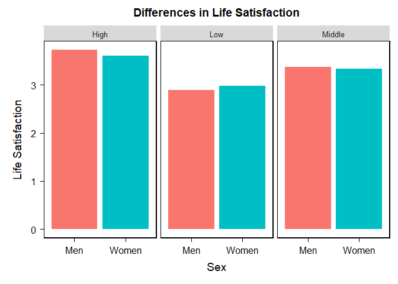
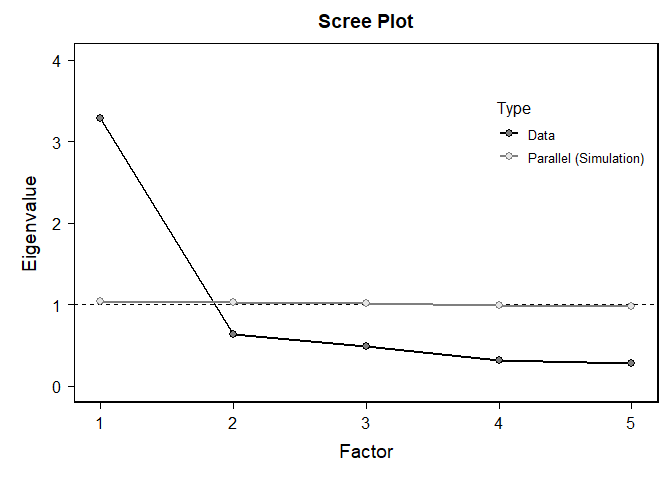

My Dataset
================
2024-11-28

``` r
# Set a CRAN mirror
options(repos = c(CRAN = "https://cran.rstudio.com/"))
```

``` r
#install.packages("dplyr")
#install.packages("ggsignif")
```

``` r
library(car)
```

    ## Loading required package: carData

``` r
library(dplyr) #recode variables
```

    ## 
    ## Attaching package: 'dplyr'

    ## The following object is masked from 'package:car':
    ## 
    ##     recode

    ## The following objects are masked from 'package:stats':
    ## 
    ##     filter, lag

    ## The following objects are masked from 'package:base':
    ## 
    ##     intersect, setdiff, setequal, union

``` r
library(tidyr)
library(ggplot2)
library(psych)
```

    ## 
    ## Attaching package: 'psych'

    ## The following objects are masked from 'package:ggplot2':
    ## 
    ##     %+%, alpha

    ## The following object is masked from 'package:car':
    ## 
    ##     logit

``` r
library(bruceR)
```

    ## 
    ## bruceR (v2024.6)
    ## Broadly Useful Convenient and Efficient R functions
    ## 
    ## Packages also loaded:
    ## ✔ data.table ✔ emmeans
    ## ✔ dplyr      ✔ lmerTest
    ## ✔ tidyr      ✔ effectsize
    ## ✔ stringr    ✔ performance
    ## ✔ ggplot2    ✔ interactions
    ## 
    ## Main functions of `bruceR`:
    ## cc()             Describe()  TTEST()
    ## add()            Freq()      MANOVA()
    ## .mean()          Corr()      EMMEANS()
    ## set.wd()         Alpha()     PROCESS()
    ## import()         EFA()       model_summary()
    ## print_table()    CFA()       lavaan_summary()
    ## 
    ## For full functionality, please install all dependencies:
    ## install.packages("bruceR", dep=TRUE)
    ## 
    ## Online documentation:
    ## https://psychbruce.github.io/bruceR
    ## 
    ## To use this package in publications, please cite:
    ## Bao, H.-W.-S. (2024). bruceR: Broadly useful convenient and efficient R functions (Version 2024.6) [Computer software]. https://CRAN.R-project.org/package=bruceR

    ## 
    ## These packages are dependencies of `bruceR` but not installed:
    ## - pacman, openxlsx, ggtext, vars, phia, MuMIn, GGally
    ## 
    ## ***** Install all dependencies *****
    ## install.packages("bruceR", dep=TRUE)

``` r
library(haven) #load CSV
library(Rmisc)
```

    ## Loading required package: lattice

    ## Loading required package: plyr

    ## ------------------------------------------------------------------------------

    ## You have loaded plyr after dplyr - this is likely to cause problems.
    ## If you need functions from both plyr and dplyr, please load plyr first, then dplyr:
    ## library(plyr); library(dplyr)

    ## ------------------------------------------------------------------------------

    ## 
    ## Attaching package: 'plyr'

    ## The following objects are masked from 'package:dplyr':
    ## 
    ##     arrange, count, desc, failwith, id, mutate, rename, summarise,
    ##     summarize

``` r
library(tidyverse)
```

    ## ── Attaching core tidyverse packages ──────────────────────── tidyverse 2.0.0 ──
    ## ✔ forcats   1.0.0     ✔ readr     2.1.5
    ## ✔ lubridate 1.9.3     ✔ tibble    3.2.1
    ## ✔ purrr     1.0.2

    ## ── Conflicts ────────────────────────────────────────── tidyverse_conflicts() ──
    ## ✖ psych::%+%()          masks ggplot2::%+%()
    ## ✖ psych::alpha()        masks ggplot2::alpha()
    ## ✖ plyr::arrange()       masks dplyr::arrange()
    ## ✖ data.table::between() masks dplyr::between()
    ## ✖ purrr::compact()      masks plyr::compact()
    ## ✖ plyr::count()         masks dplyr::count()
    ## ✖ plyr::desc()          masks dplyr::desc()
    ## ✖ Matrix::expand()      masks tidyr::expand()
    ## ✖ plyr::failwith()      masks dplyr::failwith()
    ## ✖ dplyr::filter()       masks stats::filter()
    ## ✖ data.table::first()   masks dplyr::first()
    ## ✖ lubridate::hour()     masks data.table::hour()
    ## ✖ plyr::id()            masks dplyr::id()
    ## ✖ lubridate::isoweek()  masks data.table::isoweek()
    ## ✖ dplyr::lag()          masks stats::lag()
    ## ✖ data.table::last()    masks dplyr::last()
    ## ✖ lubridate::mday()     masks data.table::mday()
    ## ✖ lubridate::minute()   masks data.table::minute()
    ## ✖ lubridate::month()    masks data.table::month()
    ## ✖ plyr::mutate()        masks dplyr::mutate()
    ## ✖ Matrix::pack()        masks tidyr::pack()
    ## ✖ lubridate::quarter()  masks data.table::quarter()
    ## ✖ dplyr::recode()       masks car::recode()
    ## ✖ plyr::rename()        masks dplyr::rename()
    ## ✖ lubridate::second()   masks data.table::second()
    ## ✖ purrr::some()         masks car::some()
    ## ✖ plyr::summarise()     masks dplyr::summarise()
    ## ✖ plyr::summarize()     masks dplyr::summarize()
    ## ✖ purrr::transpose()    masks data.table::transpose()
    ## ✖ Matrix::unpack()      masks tidyr::unpack()
    ## ✖ lubridate::wday()     masks data.table::wday()
    ## ✖ lubridate::week()     masks data.table::week()
    ## ✖ lubridate::yday()     masks data.table::yday()
    ## ✖ lubridate::year()     masks data.table::year()
    ## ℹ Use the conflicted package (<http://conflicted.r-lib.org/>) to force all conflicts to become errors

``` r
library(bruceR)
#library(ggsignif)
```

Reading dataset

``` r
# Read the TSV file
data <- read.table("C:/Users/sidne/OneDrive/Desktop/PSY329/38964-0001-Data.tsv", sep = "\t", header = TRUE, fill = TRUE, quote = "")

# Write the data to a CSV file
write.csv(data, "Excel-Data.csv", row.names = FALSE)

#open file
data <- read.csv("C:/Users/sidne/OneDrive/Desktop/PSY329/Excel-Data.csv")
```

Cleaning data set and recoding variables

``` r
clean_data <- data %>%
  select(SEX,HHINC,SAT1,SAT2,SAT3,SAT4,SAT5,LONELY_A,LONELY_B,LONELY_C,RACEREC,AGE) 

clean_data$SEX<-recode(data$SEX, '1' = 'Men', '2' = 'Women', '3'='Other')


clean_data$HOUSE_INCOME<-recode(data$HHINC, '1' = 'Low', '2' = 'Low', '3'='Low','4'='Low','5'='Low','6'='Middle','7'='Middle','8'='Middle','9'='Middle','10'='Middle','11'='High','12'='High')
```

    ## Warning: Unreplaced values treated as NA as `.x` is not compatible.
    ## Please specify replacements exhaustively or supply `.default`.

``` r
#clean_data$HAPPY_meaning<-recode(data$HAPPY, '1' = 'Very happy', '2' = 'Rather happy', '3'='Not very happy','4'='Not at all happy')

clean_data <- clean_data %>%
   mutate(Lonely=rowMeans(cbind(LONELY_A,LONELY_B,LONELY_C))) #1 hardly ever feel lonely to 5 often feel lonely 

clean_data <- clean_data %>%
  mutate(Lonely = ifelse(Lonely > 3, NA, Lonely)) #removing participants that responded don't know or refused the question

clean_data <- clean_data %>%
   mutate(Life_satisfaction=rowMeans(cbind(SAT1,SAT2,SAT3,SAT4,SAT5))) #1 strongly disagree to 5 strongly agree higher score = higher life satisfaction

clean_data <- clean_data %>%
  mutate(Life_satisfaction = ifelse(Life_satisfaction > 5, NA, Life_satisfaction))

#clean_data$HAPPY_REV <- 5 - clean_data$HAPPY #reverse code happy so higher number = happier

clean_data <- clean_data %>%
  select(SEX,HOUSE_INCOME,HHINC,Life_satisfaction, SAT1,SAT2,SAT3,SAT4,SAT5,Lonely, LONELY_A,LONELY_B,LONELY_C,RACEREC,AGE)

clean_data<- drop_na(clean_data)
clean_data <- clean_data %>% filter(SEX != "Other")
#summary (clean_data)

write.csv(clean_data, "C:/Users/sidne/OneDrive/Desktop/PSY329/clean_data.csv", row.names = FALSE)
```

Normality of Lonely

``` r
ggplot(clean_data, aes(x = Lonely)) + geom_histogram(binwidth = 0.5) + facet_wrap(~SEX)+theme_classic() #between SEX
```

<!-- -->

``` r
ggplot(clean_data, aes(x = Lonely)) + geom_histogram(binwidth = 0.5) + facet_wrap(~HOUSE_INCOME)+theme_classic() #between INCOME
```

<!-- -->

``` r
describeBy(Lonely ~ SEX, data= clean_data)
```

    ## 
    ##  Descriptive statistics by group 
    ## SEX: Men
    ##        vars    n mean   sd median trimmed  mad min max range skew kurtosis   se
    ## Lonely    1 3533 1.76 0.65   1.67     1.7 0.99   1   3     2 0.43    -0.95 0.01
    ## ------------------------------------------------------------ 
    ## SEX: Women
    ##        vars    n mean   sd median trimmed  mad min max range skew kurtosis   se
    ## Lonely    1 3749 1.85 0.63      2    1.81 0.99   1   3     2 0.26    -0.95 0.01

``` r
describeBy(Lonely ~ HOUSE_INCOME, data= clean_data)
```

    ## 
    ##  Descriptive statistics by group 
    ## HOUSE_INCOME: High
    ##        vars   n mean   sd median trimmed  mad min max range skew kurtosis   se
    ## Lonely    1 355 1.53 0.58   1.33    1.45 0.49   1   3     2 0.86    -0.31 0.03
    ## ------------------------------------------------------------ 
    ## HOUSE_INCOME: Low
    ##        vars    n mean   sd median trimmed  mad min max range skew kurtosis   se
    ## Lonely    1 4970 1.88 0.64      2    1.85 0.99   1   3     2 0.21    -1.02 0.01
    ## ------------------------------------------------------------ 
    ## HOUSE_INCOME: Middle
    ##        vars    n mean   sd median trimmed  mad min max range skew kurtosis   se
    ## Lonely    1 1957 1.66 0.61   1.67    1.59 0.99   1   3     2 0.59    -0.65 0.01

Normality of Life satisfaction

``` r
ggplot(clean_data, aes(x = Life_satisfaction)) + geom_histogram(binwidth = 0.5) + facet_wrap(~SEX)+theme_classic()
```

<!-- -->

``` r
ggplot(clean_data, aes(x = Life_satisfaction)) + geom_histogram(binwidth = 0.5) + facet_wrap(~HOUSE_INCOME)+theme_classic()
```

<!-- -->

``` r
describeBy(Life_satisfaction ~ SEX, data= clean_data)
```

    ## 
    ##  Descriptive statistics by group 
    ## SEX: Men
    ##                   vars    n mean   sd median trimmed  mad min max range  skew
    ## Life_satisfaction    1 3533 3.11 1.01    3.2    3.13 1.19   1   5     4 -0.21
    ##                   kurtosis   se
    ## Life_satisfaction    -0.69 0.02
    ## ------------------------------------------------------------ 
    ## SEX: Women
    ##                   vars    n mean   sd median trimmed  mad min max range  skew
    ## Life_satisfaction    1 3749 3.08 0.98    3.2     3.1 1.19   1   5     4 -0.19
    ##                   kurtosis   se
    ## Life_satisfaction    -0.68 0.02

``` r
describeBy(Life_satisfaction ~ HOUSE_INCOME, data= clean_data)
```

    ## 
    ##  Descriptive statistics by group 
    ## HOUSE_INCOME: High
    ##                   vars   n mean   sd median trimmed  mad min max range  skew
    ## Life_satisfaction    1 355 3.69 0.89    3.8    3.77 0.89   1   5     4 -0.77
    ##                   kurtosis   se
    ## Life_satisfaction     0.35 0.05
    ## ------------------------------------------------------------ 
    ## HOUSE_INCOME: Low
    ##                   vars    n mean   sd median trimmed  mad min max range  skew
    ## Life_satisfaction    1 4970 2.94 0.98      3    2.95 1.19   1   5     4 -0.06
    ##                   kurtosis   se
    ## Life_satisfaction    -0.68 0.01
    ## ------------------------------------------------------------ 
    ## HOUSE_INCOME: Middle
    ##                   vars    n mean   sd median trimmed  mad min max range  skew
    ## Life_satisfaction    1 1957 3.36 0.95    3.6    3.41 0.89   1   5     4 -0.49
    ##                   kurtosis   se
    ## Life_satisfaction    -0.38 0.02

Normality of Happiness

``` r
#ggplot(clean_data, aes(x = HAPPY_REV)) + geom_histogram(binwidth = 1) + facet_wrap(~SEX)+theme_classic()

#ggplot(clean_data, aes(x = HAPPY_REV)) + geom_histogram(binwidth = 1) + facet_wrap(~HOUSE_INCOME)+theme_classic()

#describeBy(HAPPY_REV ~ SEX, data= clean_data)
#describeBy(HAPPY_REV ~ HOUSE_INCOME, data= clean_data)
```

Variance of Lonely

``` r
clean_data %>%
  group_by(SEX) %>%
  summarize(variacne = var(Lonely))
```

    ##    variacne
    ## 1 0.4118587

``` r
leveneTest(Lonely~SEX, clean_data)
```

    ## Warning in leveneTest.default(y = y, group = group, ...): group coerced to
    ## factor.

    ## Levene's Test for Homogeneity of Variance (center = median)
    ##         Df F value Pr(>F)
    ## group    1  2.4308  0.119
    ##       7280

``` r
clean_data %>%
  group_by(HOUSE_INCOME) %>%
  summarize(variacne = var(Lonely))
```

    ##    variacne
    ## 1 0.4118587

``` r
leveneTest(Lonely~HOUSE_INCOME, clean_data)
```

    ## Warning in leveneTest.default(y = y, group = group, ...): group coerced to
    ## factor.

    ## Levene's Test for Homogeneity of Variance (center = median)
    ##         Df F value    Pr(>F)    
    ## group    2  9.4275 8.147e-05 ***
    ##       7279                      
    ## ---
    ## Signif. codes:  0 '***' 0.001 '**' 0.01 '*' 0.05 '.' 0.1 ' ' 1

Variance of Life satisfaction

``` r
clean_data %>%
  group_by(SEX) %>%
  summarize(variacne = var(Life_satisfaction))
```

    ##    variacne
    ## 1 0.9842728

``` r
leveneTest(Life_satisfaction~SEX, clean_data)
```

    ## Warning in leveneTest.default(y = y, group = group, ...): group coerced to
    ## factor.

    ## Levene's Test for Homogeneity of Variance (center = median)
    ##         Df F value  Pr(>F)  
    ## group    1  3.3263 0.06822 .
    ##       7280                  
    ## ---
    ## Signif. codes:  0 '***' 0.001 '**' 0.01 '*' 0.05 '.' 0.1 ' ' 1

``` r
clean_data %>%
  group_by(HOUSE_INCOME) %>%
  summarize(variacne = var(Life_satisfaction))
```

    ##    variacne
    ## 1 0.9842728

``` r
leveneTest(Life_satisfaction~HOUSE_INCOME, clean_data)
```

    ## Warning in leveneTest.default(y = y, group = group, ...): group coerced to
    ## factor.

    ## Levene's Test for Homogeneity of Variance (center = median)
    ##         Df F value    Pr(>F)    
    ## group    2  9.0104 0.0001235 ***
    ##       7279                      
    ## ---
    ## Signif. codes:  0 '***' 0.001 '**' 0.01 '*' 0.05 '.' 0.1 ' ' 1

Variance of Happiness

``` r
#clean_data %>%
 # group_by(SEX) %>%
  #summarize(variacne = var(HAPPY_REV))

#leveneTest(HAPPY_REV~SEX, clean_data)

#clean_data %>%
 # group_by(HOUSE_INCOME) %>%
#  summarize(variacne = var(Life_satisfaction))

#leveneTest(HAPPY_REV~HOUSE_INCOME, clean_data)
```

Life satisfaction ANOVA

``` r
mod<-MANOVA(clean_data, dv = "Life_satisfaction", between = c("SEX", "HOUSE_INCOME")) 
```

    ## 
    ## ====== ANOVA (Between-Subjects Design) ======
    ## 
    ## Descriptives:
    ## ────────────────────────────────────────
    ##  "SEX" "HOUSE_INCOME"  Mean    S.D.    n
    ## ────────────────────────────────────────
    ##  Men           High   3.727 (0.880)  252
    ##  Men           Low    2.890 (0.983) 2151
    ##  Men           Middle 3.379 (0.960) 1130
    ##  Women         High   3.606 (0.928)  103
    ##  Women         Low    2.983 (0.973) 2819
    ##  Women         Middle 3.331 (0.926)  827
    ## ────────────────────────────────────────
    ## Total sample size: N = 7282
    ## 
    ## ANOVA Table:
    ## Dependent variable(s):      Life_satisfaction
    ## Between-subjects factor(s): SEX, HOUSE_INCOME
    ## Within-subjects factor(s):  –
    ## Covariate(s):               –
    ## ─────────────────────────────────────────────────────────────────────────────────────
    ##                          MS   MSE df1  df2       F     p     η²p [90% CI of η²p]  η²G
    ## ─────────────────────────────────────────────────────────────────────────────────────
    ## SEX                   0.351 0.931   1 7276   0.377  .539       .000 [.000, .001] .000
    ## HOUSE_INCOME        172.478 0.931   2 7276 185.186 <.001 ***   .048 [.041, .057] .048
    ## SEX * HOUSE_INCOME    4.460 0.931   2 7276   4.789  .008 **    .001 [.000, .003] .001
    ## ─────────────────────────────────────────────────────────────────────────────────────
    ## MSE = mean square error (the residual variance of the linear model)
    ## η²p = partial eta-squared = SS / (SS + SSE) = F * df1 / (F * df1 + df2)
    ## ω²p = partial omega-squared = (F - 1) * df1 / (F * df1 + df2 + 1)
    ## η²G = generalized eta-squared (see Olejnik & Algina, 2003)
    ## Cohen’s f² = η²p / (1 - η²p)
    ## 
    ## Levene’s Test for Homogeneity of Variance:
    ## ────────────────────────────────────────────────────
    ##                        Levene’s F df1  df2     p    
    ## ────────────────────────────────────────────────────
    ## DV: Life_satisfaction       3.006   5 7276  .010 *  
    ## ────────────────────────────────────────────────────

``` r
EMMEANS(mod, effect = "SEX", by = "HOUSE_INCOME", p.adjust = "none")
```

    ## ------ EMMEANS (effect = "SEX") ------
    ## 
    ## Joint Tests of "SEX":
    ## ────────────────────────────────────────────────────────────────────
    ##  Effect "HOUSE_INCOME" df1  df2      F     p     η²p [90% CI of η²p]
    ## ────────────────────────────────────────────────────────────────────
    ##     SEX         High     1 7276  1.152  .283       .000 [.000, .001]
    ##     SEX         Low      1 7276 11.266 <.001 ***   .002 [.000, .003]
    ##     SEX         Middle   1 7276  1.178  .278       .000 [.000, .001]
    ## ────────────────────────────────────────────────────────────────────
    ## Note. Simple effects of repeated measures with 3 or more levels
    ## are different from the results obtained with SPSS MANOVA syntax.
    ## 
    ## Estimated Marginal Means of "SEX":
    ## ───────────────────────────────────────────────────
    ##  "SEX" "HOUSE_INCOME" Mean [95% CI of Mean]    S.E.
    ## ───────────────────────────────────────────────────
    ##  Men           High    3.727 [3.608, 3.846] (0.061)
    ##  Women         High    3.606 [3.419, 3.792] (0.095)
    ##  Men           Low     2.890 [2.850, 2.931] (0.021)
    ##  Women         Low     2.983 [2.947, 3.019] (0.018)
    ##  Men           Middle  3.379 [3.322, 3.435] (0.029)
    ##  Women         Middle  3.331 [3.265, 3.397] (0.034)
    ## ───────────────────────────────────────────────────
    ## 
    ## Pairwise Comparisons of "SEX":
    ## ──────────────────────────────────────────────────────────────────────────────────────────
    ##     Contrast "HOUSE_INCOME" Estimate    S.E.   df      t     p     Cohen’s d [95% CI of d]
    ## ──────────────────────────────────────────────────────────────────────────────────────────
    ##  Women - Men         High     -0.121 (0.113) 7276 -1.073  .283      -0.126 [-0.355, 0.104]
    ##  Women - Men         Low       0.093 (0.028) 7276  3.356 <.001 ***   0.096 [ 0.040, 0.152]
    ##  Women - Men         Middle   -0.048 (0.044) 7276 -1.085  .278      -0.050 [-0.139, 0.040]
    ## ──────────────────────────────────────────────────────────────────────────────────────────
    ## Pooled SD for computing Cohen’s d: 0.965
    ## 
    ## Disclaimer:
    ## By default, pooled SD is Root Mean Square Error (RMSE).
    ## There is much disagreement on how to compute Cohen’s d.
    ## You are completely responsible for setting `sd.pooled`.
    ## You might also use `effectsize::t_to_d()` to compute d.

``` r
EMMEANS(mod, effect = "HOUSE_INCOME", by = "SEX", p.adjust = "none")
```

    ## ------ EMMEANS (effect = "HOUSE_INCOME") ------
    ## 
    ## Joint Tests of "HOUSE_INCOME":
    ## ──────────────────────────────────────────────────────────────────
    ##        Effect "SEX" df1  df2       F     p     η²p [90% CI of η²p]
    ## ──────────────────────────────────────────────────────────────────
    ##  HOUSE_INCOME Men     2 7276 150.988 <.001 ***   .040 [.033, .047]
    ##  HOUSE_INCOME Women   2 7276  57.408 <.001 ***   .016 [.011, .020]
    ## ──────────────────────────────────────────────────────────────────
    ## Note. Simple effects of repeated measures with 3 or more levels
    ## are different from the results obtained with SPSS MANOVA syntax.
    ## 
    ## Estimated Marginal Means of "HOUSE_INCOME":
    ## ───────────────────────────────────────────────────
    ##  "HOUSE_INCOME" "SEX" Mean [95% CI of Mean]    S.E.
    ## ───────────────────────────────────────────────────
    ##          High   Men    3.727 [3.608, 3.846] (0.061)
    ##          Low    Men    2.890 [2.850, 2.931] (0.021)
    ##          Middle Men    3.379 [3.322, 3.435] (0.029)
    ##          High   Women  3.606 [3.419, 3.792] (0.095)
    ##          Low    Women  2.983 [2.947, 3.019] (0.018)
    ##          Middle Women  3.331 [3.265, 3.397] (0.034)
    ## ───────────────────────────────────────────────────
    ## 
    ## Pairwise Comparisons of "HOUSE_INCOME":
    ## ────────────────────────────────────────────────────────────────────────────────────
    ##       Contrast "SEX" Estimate    S.E.   df       t     p     Cohen’s d [95% CI of d]
    ## ────────────────────────────────────────────────────────────────────────────────────
    ##  Low - High    Men     -0.837 (0.064) 7276 -13.020 <.001 *** -0.867 [-0.997, -0.736]
    ##  Middle - High Men     -0.348 (0.067) 7276  -5.179 <.001 *** -0.361 [-0.497, -0.224]
    ##  Middle - Low  Men      0.488 (0.035) 7276  13.774 <.001 ***  0.506 [ 0.434,  0.578]
    ##  Low - High    Women   -0.623 (0.097) 7276  -6.432 <.001 *** -0.645 [-0.842, -0.449]
    ##  Middle - High Women   -0.275 (0.101) 7276  -2.727  .006 **  -0.285 [-0.490, -0.080]
    ##  Middle - Low  Women    0.348 (0.038) 7276   9.111 <.001 ***  0.360 [ 0.283,  0.438]
    ## ────────────────────────────────────────────────────────────────────────────────────
    ## Pooled SD for computing Cohen’s d: 0.965
    ## 
    ## Disclaimer:
    ## By default, pooled SD is Root Mean Square Error (RMSE).
    ## There is much disagreement on how to compute Cohen’s d.
    ## You are completely responsible for setting `sd.pooled`.
    ## You might also use `effectsize::t_to_d()` to compute d.

Loneliness

``` r
mod<-MANOVA(clean_data, dv = "Lonely", between = c("SEX", "HOUSE_INCOME")) 
```

    ## 
    ## ====== ANOVA (Between-Subjects Design) ======
    ## 
    ## Descriptives:
    ## ────────────────────────────────────────
    ##  "SEX" "HOUSE_INCOME"  Mean    S.D.    n
    ## ────────────────────────────────────────
    ##  Men           High   1.484 (0.567)  252
    ##  Men           Low    1.874 (0.654) 2151
    ##  Men           Middle 1.604 (0.608) 1130
    ##  Women         High   1.654 (0.607)  103
    ##  Women         Low    1.888 (0.636) 2819
    ##  Women         Middle 1.730 (0.600)  827
    ## ────────────────────────────────────────
    ## Total sample size: N = 7282
    ## 
    ## ANOVA Table:
    ## Dependent variable(s):      Lonely
    ## Between-subjects factor(s): SEX, HOUSE_INCOME
    ## Within-subjects factor(s):  –
    ## Covariate(s):               –
    ## ────────────────────────────────────────────────────────────────────────────────────
    ##                         MS   MSE df1  df2       F     p     η²p [90% CI of η²p]  η²G
    ## ────────────────────────────────────────────────────────────────────────────────────
    ## SEX                  5.780 0.397   1 7276  14.551 <.001 ***   .002 [.001, .004] .002
    ## HOUSE_INCOME        40.505 0.397   2 7276 101.975 <.001 ***   .027 [.021, .034] .027
    ## SEX * HOUSE_INCOME   2.722 0.397   2 7276   6.853  .001 **    .002 [.000, .004] .002
    ## ────────────────────────────────────────────────────────────────────────────────────
    ## MSE = mean square error (the residual variance of the linear model)
    ## η²p = partial eta-squared = SS / (SS + SSE) = F * df1 / (F * df1 + df2)
    ## ω²p = partial omega-squared = (F - 1) * df1 / (F * df1 + df2 + 1)
    ## η²G = generalized eta-squared (see Olejnik & Algina, 2003)
    ## Cohen’s f² = η²p / (1 - η²p)
    ## 
    ## Levene’s Test for Homogeneity of Variance:
    ## ─────────────────────────────────────────
    ##             Levene’s F df1  df2     p    
    ## ─────────────────────────────────────────
    ## DV: Lonely       5.365   5 7276 <.001 ***
    ## ─────────────────────────────────────────

``` r
EMMEANS(mod, effect = "SEX", by = "HOUSE_INCOME", p.adjust = "none")
```

    ## ------ EMMEANS (effect = "SEX") ------
    ## 
    ## Joint Tests of "SEX":
    ## ────────────────────────────────────────────────────────────────────
    ##  Effect "HOUSE_INCOME" df1  df2      F     p     η²p [90% CI of η²p]
    ## ────────────────────────────────────────────────────────────────────
    ##     SEX         High     1 7276  5.294  .021 *     .001 [.000, .002]
    ##     SEX         Low      1 7276  0.573  .449       .000 [.000, .001]
    ##     SEX         Middle   1 7276 19.210 <.001 ***   .003 [.001, .005]
    ## ────────────────────────────────────────────────────────────────────
    ## Note. Simple effects of repeated measures with 3 or more levels
    ## are different from the results obtained with SPSS MANOVA syntax.
    ## 
    ## Estimated Marginal Means of "SEX":
    ## ───────────────────────────────────────────────────
    ##  "SEX" "HOUSE_INCOME" Mean [95% CI of Mean]    S.E.
    ## ───────────────────────────────────────────────────
    ##  Men           High    1.484 [1.406, 1.562] (0.040)
    ##  Women         High    1.654 [1.532, 1.775] (0.062)
    ##  Men           Low     1.874 [1.848, 1.901] (0.014)
    ##  Women         Low     1.888 [1.865, 1.911] (0.012)
    ##  Men           Middle  1.604 [1.567, 1.640] (0.019)
    ##  Women         Middle  1.730 [1.687, 1.773] (0.022)
    ## ───────────────────────────────────────────────────
    ## 
    ## Pairwise Comparisons of "SEX":
    ## ─────────────────────────────────────────────────────────────────────────────────────────
    ##     Contrast "HOUSE_INCOME" Estimate    S.E.   df     t     p     Cohen’s d [95% CI of d]
    ## ─────────────────────────────────────────────────────────────────────────────────────────
    ##  Women - Men         High      0.170 (0.074) 7276 2.301  .021 *     0.269 [ 0.040, 0.498]
    ##  Women - Men         Low       0.014 (0.018) 7276 0.757  .449       0.022 [-0.034, 0.078]
    ##  Women - Men         Middle    0.126 (0.029) 7276 4.383 <.001 ***   0.201 [ 0.111, 0.290]
    ## ─────────────────────────────────────────────────────────────────────────────────────────
    ## Pooled SD for computing Cohen’s d: 0.630
    ## 
    ## Disclaimer:
    ## By default, pooled SD is Root Mean Square Error (RMSE).
    ## There is much disagreement on how to compute Cohen’s d.
    ## You are completely responsible for setting `sd.pooled`.
    ## You might also use `effectsize::t_to_d()` to compute d.

``` r
EMMEANS(mod, effect = "HOUSE_INCOME", by = "SEX", p.adjust = "none")
```

    ## ------ EMMEANS (effect = "HOUSE_INCOME") ------
    ## 
    ## Joint Tests of "HOUSE_INCOME":
    ## ─────────────────────────────────────────────────────────────────
    ##        Effect "SEX" df1  df2      F     p     η²p [90% CI of η²p]
    ## ─────────────────────────────────────────────────────────────────
    ##  HOUSE_INCOME Men     2 7276 94.447 <.001 ***   .025 [.020, .031]
    ##  HOUSE_INCOME Women   2 7276 25.113 <.001 ***   .007 [.004, .010]
    ## ─────────────────────────────────────────────────────────────────
    ## Note. Simple effects of repeated measures with 3 or more levels
    ## are different from the results obtained with SPSS MANOVA syntax.
    ## 
    ## Estimated Marginal Means of "HOUSE_INCOME":
    ## ───────────────────────────────────────────────────
    ##  "HOUSE_INCOME" "SEX" Mean [95% CI of Mean]    S.E.
    ## ───────────────────────────────────────────────────
    ##          High   Men    1.484 [1.406, 1.562] (0.040)
    ##          Low    Men    1.874 [1.848, 1.901] (0.014)
    ##          Middle Men    1.604 [1.567, 1.640] (0.019)
    ##          High   Women  1.654 [1.532, 1.775] (0.062)
    ##          Low    Women  1.888 [1.865, 1.911] (0.012)
    ##          Middle Women  1.730 [1.687, 1.773] (0.022)
    ## ───────────────────────────────────────────────────
    ## 
    ## Pairwise Comparisons of "HOUSE_INCOME":
    ## ────────────────────────────────────────────────────────────────────────────────────
    ##       Contrast "SEX" Estimate    S.E.   df       t     p     Cohen’s d [95% CI of d]
    ## ────────────────────────────────────────────────────────────────────────────────────
    ##  Low - High    Men      0.390 (0.042) 7276   9.302 <.001 ***  0.619 [ 0.489,  0.750]
    ##  Middle - High Men      0.119 (0.044) 7276   2.720  .007 **   0.189 [ 0.053,  0.326]
    ##  Middle - Low  Men     -0.271 (0.023) 7276 -11.701 <.001 *** -0.430 [-0.502, -0.358]
    ##  Low - High    Women    0.234 (0.063) 7276   3.708 <.001 ***  0.372 [ 0.175,  0.569]
    ##  Middle - High Women    0.076 (0.066) 7276   1.158  .247      0.121 [-0.084,  0.326]
    ##  Middle - Low  Women   -0.158 (0.025) 7276  -6.347 <.001 *** -0.251 [-0.329, -0.173]
    ## ────────────────────────────────────────────────────────────────────────────────────
    ## Pooled SD for computing Cohen’s d: 0.630
    ## 
    ## Disclaimer:
    ## By default, pooled SD is Root Mean Square Error (RMSE).
    ## There is much disagreement on how to compute Cohen’s d.
    ## You are completely responsible for setting `sd.pooled`.
    ## You might also use `effectsize::t_to_d()` to compute d.

Graphs

``` r
#plot$HOUSE_INCOME <- factor(plot$HOUSE_INCOME, levels = c("Low", "Middle", "High"))
plot<-summarySE(clean_data, measurevar="Life_satisfaction", groupvars=c("SEX", "HOUSE_INCOME"))

ggplot(plot, aes(x = SEX, y = Life_satisfaction, fill = SEX)) +
  geom_col() + facet_wrap(~ HOUSE_INCOME) + theme_bruce() + labs(x = "Sex", y = "Life Satisfaction",title= "Differences in Life Satisfaction") +guides(fill=FALSE)
```

    ## Warning: The `<scale>` argument of `guides()` cannot be `FALSE`. Use "none" instead as
    ## of ggplot2 3.3.4.
    ## This warning is displayed once every 8 hours.
    ## Call `lifecycle::last_lifecycle_warnings()` to see where this warning was
    ## generated.

<!-- -->

``` r
#plot2$HOUSE_INCOME <- factor(plot2$HOUSE_INCOME, levels = c("Low", "Middle", "High"))

plot2<-summarySE(clean_data, measurevar="Lonely", groupvars=c("SEX", "HOUSE_INCOME"))
ggplot(plot2, aes(x = SEX, y = Lonely, fill = SEX)) +
  geom_col() + facet_wrap(~ HOUSE_INCOME) + theme_bruce() + labs(x = "Sex", y = "Loneliness", title= "Differences in Loneliness" ) + guides(fill=FALSE)
```

<!-- -->

``` r
clean_data$HHINC_n<-as.numeric(clean_data$HHINC)

PROCESS(clean_data, y = "Life_satisfaction", x = "HHINC_n", mods = c("SEX"))
```

    ## 
    ## ****************** PART 1. Regression Model Summary ******************
    ## 
    ## PROCESS Model Code : 1 (Hayes, 2018; www.guilford.com/p/hayes3)
    ## PROCESS Model Type : Simple Moderation
    ## -    Outcome (Y) : Life_satisfaction
    ## -  Predictor (X) : HHINC_n
    ## -  Mediators (M) : -
    ## - Moderators (W) : SEX
    ## - Covariates (C) : -
    ## -   HLM Clusters : -
    ## 
    ## All numeric predictors have been grand-mean centered.
    ## (For details, please see the help page of PROCESS.)
    ## 
    ## Formula of Outcome:
    ## -    Life_satisfaction ~ HHINC_n*SEX
    ## 
    ## CAUTION:
    ##   Fixed effect (coef.) of a predictor involved in an interaction
    ##   denotes its "simple effect/slope" at the other predictor = 0.
    ##   Only when all predictors in an interaction are mean-centered
    ##   can the fixed effect denote the "main effect"!
    ##   
    ## Model Summary
    ## 
    ## ──────────────────────────────────────────────────────────────
    ##                   (1) Life_satisfaction  (2) Life_satisfaction
    ## ──────────────────────────────────────────────────────────────
    ## (Intercept)          3.091 ***              3.050 ***         
    ##                     (0.011)                (0.016)            
    ## HHINC_n              0.088 ***              0.102 ***         
    ##                     (0.004)                (0.005)            
    ## SEXWomen                                    0.067 **          
    ##                                            (0.023)            
    ## HHINC_n:SEXWomen                           -0.027 ***         
    ##                                            (0.008)            
    ## ──────────────────────────────────────────────────────────────
    ## R^2                  0.068                  0.071             
    ## Adj. R^2             0.068                  0.070             
    ## Num. obs.         7282                   7282                 
    ## ──────────────────────────────────────────────────────────────
    ## Note. * p < .05, ** p < .01, *** p < .001.
    ## 
    ## ************ PART 2. Mediation/Moderation Effect Estimate ************
    ## 
    ## Package Use : ‘interactions’ (v1.2.0)
    ## Effect Type : Simple Moderation (Model 1)
    ## Sample Size : 7282
    ## Random Seed : -
    ## Simulations : -
    ## 
    ## Interaction Effect on "Life_satisfaction" (Y)
    ## ───────────────────────────────────────
    ##                    F df1  df2     p    
    ## ───────────────────────────────────────
    ## HHINC_n * SEX  12.16   1 7278 <.001 ***
    ## ───────────────────────────────────────
    ## 
    ## Simple Slopes: "HHINC_n" (X) ==> "Life_satisfaction" (Y)
    ## ─────────────────────────────────────────────────────
    ##  "SEX" Effect    S.E.      t     p           [95% CI]
    ## ─────────────────────────────────────────────────────
    ##  Men    0.102 (0.005) 19.843 <.001 *** [0.092, 0.112]
    ##  Women  0.075 (0.006) 12.619 <.001 *** [0.063, 0.087]
    ## ─────────────────────────────────────────────────────

``` r
ggplot(clean_data, aes(x = HHINC_n, y = Life_satisfaction)) + geom_point() + geom_smooth() + theme_bruce() +facet_wrap("SEX")
```

    ## `geom_smooth()` using method = 'gam' and formula = 'y ~ s(x, bs = "cs")'

<!-- -->

``` r
PROCESS(clean_data, y = "Lonely", x = "HHINC_n", mods = c("SEX"))
```

    ## 
    ## ****************** PART 1. Regression Model Summary ******************
    ## 
    ## PROCESS Model Code : 1 (Hayes, 2018; www.guilford.com/p/hayes3)
    ## PROCESS Model Type : Simple Moderation
    ## -    Outcome (Y) : Lonely
    ## -  Predictor (X) : HHINC_n
    ## -  Mediators (M) : -
    ## - Moderators (W) : SEX
    ## - Covariates (C) : -
    ## -   HLM Clusters : -
    ## 
    ## All numeric predictors have been grand-mean centered.
    ## (For details, please see the help page of PROCESS.)
    ## 
    ## Formula of Outcome:
    ## -    Lonely ~ HHINC_n*SEX
    ## 
    ## CAUTION:
    ##   Fixed effect (coef.) of a predictor involved in an interaction
    ##   denotes its "simple effect/slope" at the other predictor = 0.
    ##   Only when all predictors in an interaction are mean-centered
    ##   can the fixed effect denote the "main effect"!
    ##   
    ## Model Summary
    ## 
    ## ────────────────────────────────────────────
    ##                   (1) Lonely    (2) Lonely  
    ## ────────────────────────────────────────────
    ## (Intercept)          1.805 ***     1.790 ***
    ##                     (0.007)       (0.011)   
    ## HHINC_n             -0.047 ***    -0.054 ***
    ##                     (0.003)       (0.003)   
    ## SEXWomen                           0.039 ** 
    ##                                   (0.015)   
    ## HHINC_n:SEXWomen                   0.021 ***
    ##                                   (0.005)   
    ## ────────────────────────────────────────────
    ## R^2                  0.045         0.048    
    ## Adj. R^2             0.045         0.048    
    ## Num. obs.         7282          7282        
    ## ────────────────────────────────────────────
    ## Note. * p < .05, ** p < .01, *** p < .001.
    ## 
    ## ************ PART 2. Mediation/Moderation Effect Estimate ************
    ## 
    ## Package Use : ‘interactions’ (v1.2.0)
    ## Effect Type : Simple Moderation (Model 1)
    ## Sample Size : 7282
    ## Random Seed : -
    ## Simulations : -
    ## 
    ## Interaction Effect on "Lonely" (Y)
    ## ───────────────────────────────────────
    ##                    F df1  df2     p    
    ## ───────────────────────────────────────
    ## HHINC_n * SEX  16.21   1 7278 <.001 ***
    ## ───────────────────────────────────────
    ## 
    ## Simple Slopes: "HHINC_n" (X) ==> "Lonely" (Y)
    ## ────────────────────────────────────────────────────────
    ##  "SEX" Effect    S.E.       t     p             [95% CI]
    ## ────────────────────────────────────────────────────────
    ##  Men   -0.054 (0.003) -16.071 <.001 *** [-0.061, -0.048]
    ##  Women -0.034 (0.004)  -8.628 <.001 *** [-0.041, -0.026]
    ## ────────────────────────────────────────────────────────

``` r
ggplot(clean_data, aes(x = HHINC_n, y = Lonely)) + geom_point() + geom_smooth() + theme_bruce() +facet_wrap("SEX")
```

    ## `geom_smooth()` using method = 'gam' and formula = 'y ~ s(x, bs = "cs")'

<!-- -->
Reliability and Factor analysis for Satisfaction with Life

``` r
Alpha(clean_data, "SAT", 1:5) 
```

    ## 
    ## Reliability Analysis
    ## 
    ## Summary:
    ## Total Items: 5
    ## Scale Range: 1 ~ 5
    ## Total Cases: 7282
    ## Valid Cases: 7282 (100.0%)
    ## 
    ## Scale Statistics:
    ## Mean = 3.091
    ## S.D. = 0.992
    ## Cronbach’s α = 0.865
    ## McDonald’s ω = 0.871
    ## 
    ## Item Statistics (Cronbach’s α If Item Deleted):
    ## ───────────────────────────────────────────────
    ##        Mean    S.D. Item-Rest Cor. Cronbach’s α
    ## ───────────────────────────────────────────────
    ## SAT1  3.038 (1.188)          0.735        0.824
    ## SAT2  3.035 (1.188)          0.735        0.824
    ## SAT3  3.277 (1.239)          0.777        0.813
    ## SAT4  3.375 (1.212)          0.661        0.842
    ## SAT5  2.731 (1.327)          0.540        0.875
    ## ───────────────────────────────────────────────
    ## Item-Rest Cor. = Corrected Item-Total Correlation

``` r
EFA(clean_data, "SAT", 1:5, method = "pa", plot.scree = TRUE, nfactors = c("parallel"))
```

    ## 
    ## Explanatory Factor Analysis
    ## 
    ## Summary:
    ## Total Items: 5
    ## Scale Range: 1 ~ 5
    ## Total Cases: 7282
    ## Valid Cases: 7282 (100.0%)
    ## 
    ## Extraction Method:
    ## - Principal Axis Factor Analysis
    ## Rotation Method:
    ## - (Only one component was extracted. The solution was not rotated.)
    ## 
    ## KMO and Bartlett's Test:
    ## - Kaiser-Meyer-Olkin (KMO) Measure of Sampling Adequacy: MSA = 0.861
    ## - Bartlett's Test of Sphericity: Approx. χ²(10) = 17602.85, p < 1e-99 ***
    ## 
    ## Total Variance Explained:
    ## ───────────────────────────────────────────────────────────────────────────────
    ##           Eigenvalue Variance % Cumulative % SS Loading Variance % Cumulative %
    ## ───────────────────────────────────────────────────────────────────────────────
    ## Factor 1       3.285     65.709       65.709      2.895     57.895       57.895
    ## Factor 2       0.632     12.645       78.354                                   
    ## Factor 3       0.488      9.770       88.124                                   
    ## Factor 4       0.316      6.328       94.452                                   
    ## Factor 5       0.277      5.548      100.000                                   
    ## ───────────────────────────────────────────────────────────────────────────────
    ## 
    ## Factor Loadings (Sorted by Size):
    ## ───────────────────────
    ##         PA1 Communality
    ## ───────────────────────
    ## SAT3  0.861       0.741
    ## SAT2  0.812       0.660
    ## SAT1  0.810       0.656
    ## SAT4  0.712       0.507
    ## SAT5  0.575       0.330
    ## ───────────────────────
    ## Communality = Sum of Squared (SS) Factor Loadings
    ## (Uniqueness = 1 - Communality)

<!-- -->

Reliability and Factor analysis for Lonliness

``` r
Alpha(clean_data,"LONELY_", c("A","B","C"))
```

    ## 
    ## Reliability Analysis
    ## 
    ## Summary:
    ## Total Items: 3
    ## Scale Range: 1 ~ 3
    ## Total Cases: 7282
    ## Valid Cases: 7282 (100.0%)
    ## 
    ## Scale Statistics:
    ## Mean = 1.805
    ## S.D. = 0.642
    ## Cronbach’s α = 0.819
    ## McDonald’s ω = 0.826
    ## 
    ## Item Statistics (Cronbach’s α If Item Deleted):
    ## ───────────────────────────────────────────────────
    ##            Mean    S.D. Item-Rest Cor. Cronbach’s α
    ## ───────────────────────────────────────────────────
    ## LONELY_A  1.768 (0.744)          0.581        0.839
    ## LONELY_B  1.804 (0.737)          0.723        0.699
    ## LONELY_C  1.842 (0.767)          0.718        0.702
    ## ───────────────────────────────────────────────────
    ## Item-Rest Cor. = Corrected Item-Total Correlation

``` r
EFA(clean_data, "LONELY_", c("A","B","C"), method = "pa", plot.scree = TRUE, nfactors = c("parallel"))
```

    ## 
    ## Explanatory Factor Analysis
    ## 
    ## Summary:
    ## Total Items: 3
    ## Scale Range: 1 ~ 3
    ## Total Cases: 7282
    ## Valid Cases: 7282 (100.0%)
    ## 
    ## Extraction Method:
    ## - Principal Axis Factor Analysis
    ## Rotation Method:
    ## - (Only one component was extracted. The solution was not rotated.)
    ## 
    ## KMO and Bartlett's Test:
    ## - Kaiser-Meyer-Olkin (KMO) Measure of Sampling Adequacy: MSA = 0.687
    ## - Bartlett's Test of Sphericity: Approx. χ²(3) = 8403.64, p < 1e-99 ***
    ## 
    ## Total Variance Explained:
    ## ───────────────────────────────────────────────────────────────────────────────
    ##           Eigenvalue Variance % Cumulative % SS Loading Variance % Cumulative %
    ## ───────────────────────────────────────────────────────────────────────────────
    ## Factor 1       2.206     73.546       73.546      1.849     61.632       61.632
    ## Factor 2       0.518     17.253       90.799                                   
    ## Factor 3       0.276      9.201      100.000                                   
    ## ───────────────────────────────────────────────────────────────────────────────
    ## 
    ## Factor Loadings (Sorted by Size):
    ## ───────────────────────────
    ##             PA1 Communality
    ## ───────────────────────────
    ## LONELY_B  0.853       0.727
    ## LONELY_C  0.848       0.719
    ## LONELY_A  0.635       0.403
    ## ───────────────────────────
    ## Communality = Sum of Squared (SS) Factor Loadings
    ## (Uniqueness = 1 - Communality)

<!-- -->
