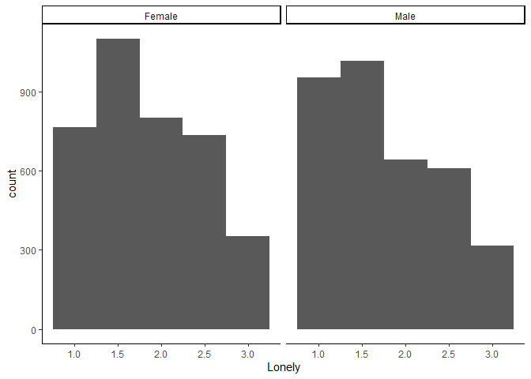
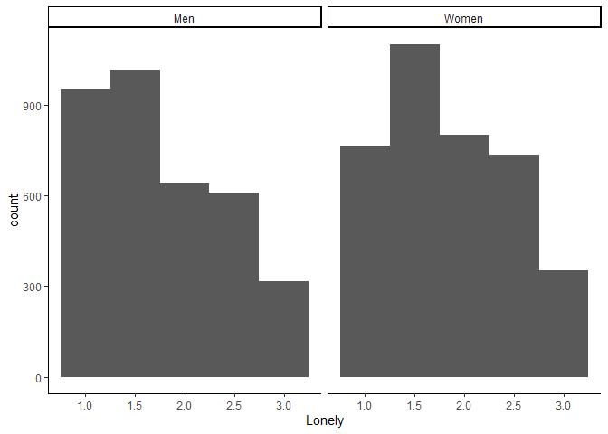
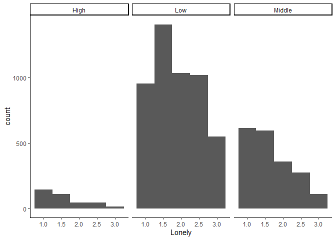
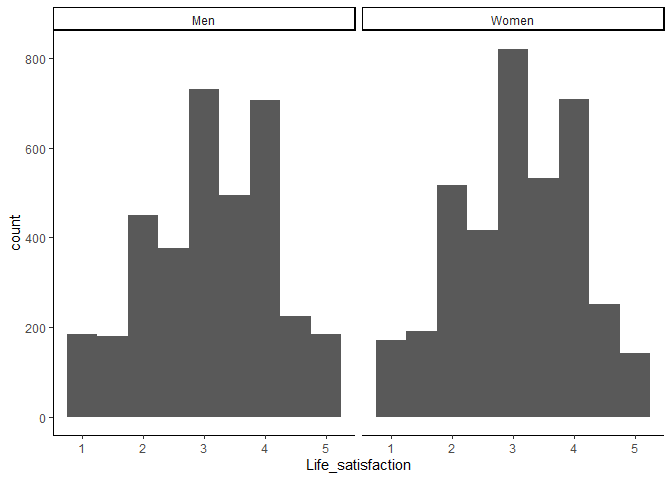
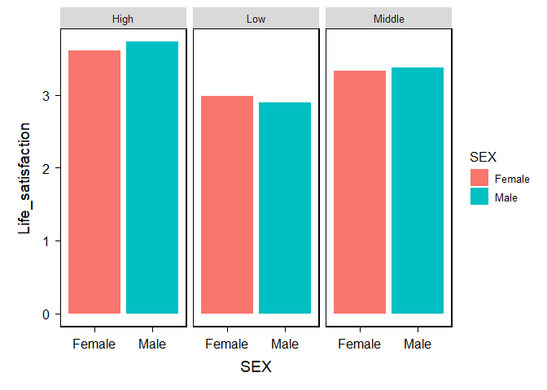

My Dataset
================
2024-09-26

``` r
# Set a CRAN mirror
options(repos = c(CRAN = "https://cran.rstudio.com/"))
```

``` r
#install.packages("dplyr")
library(car)
```

    ## Loading required package: carData

``` r
library(dplyr) #recode variables
```

    ## 
    ## Attaching package: 'dplyr'

    ## The following object is masked from 'package:car':
    ## 
    ##     recode

    ## The following objects are masked from 'package:stats':
    ## 
    ##     filter, lag

    ## The following objects are masked from 'package:base':
    ## 
    ##     intersect, setdiff, setequal, union

``` r
library(tidyr)
library(ggplot2)
#library(psych)
#library(bruceR)
library(haven) #load CSV

#install.packages("nortest")

#ibrary(nortest)
#install.packages("car")
```

Reading dataset

``` r
# Read the TSV file
data <- read.table("C:/Users/sidne/OneDrive/Desktop/PSY329/38964-0001-Data.tsv", sep = "\t", header = TRUE, fill = TRUE, quote = "")

# Write the data to a CSV file
write.csv(data, "Excel-Data.csv", row.names = FALSE)

#open file
data <- read.csv("C:/Users/sidne/OneDrive/Desktop/PSY329/Excel-Data.csv")
```

Cleaning data set and recoding variables

``` r
clean_data <- data %>%
  select(SEX,HHINC,HAPPY,SAT1,SAT2,SAT3,SAT4,SAT5,LONELY_A,LONELY_B,LONELY_C) 

clean_data$SEX<-recode(data$SEX, '1' = 'Male', '2' = 'Female', '3'='Other')


clean_data$HOUSE_INCOME<-recode(data$HHINC, '1' = 'Low', '2' = 'Low', '3'='Low','4'='Low','5'='Low','6'='Middle','7'='Middle','8'='Middle','9'='Middle','10'='Middle','11'='High','12'='High')
```

    ## Warning: Unreplaced values treated as NA as `.x` is not compatible.
    ## Please specify replacements exhaustively or supply `.default`.

``` r
clean_data$HAPPY_meaning<-recode(data$HAPPY, '1' = 'Very happy', '2' = 'Rather happy', '3'='Not very happy','4'='Not at all happy')

clean_data <- clean_data %>%
   mutate(Lonely=rowMeans(cbind(LONELY_A,LONELY_B,LONELY_C))) #1 hardly ever feel lonely to 5 often feel lonely 

clean_data <- clean_data %>%
  mutate(Lonely = ifelse(Lonely > 3, NA, Lonely)) #removing participants that responded don't know or refused the question

clean_data <- clean_data %>%
   mutate(Life_satisfaction=rowMeans(cbind(SAT1,SAT2,SAT3,SAT4,SAT5))) #1 strongly disagree to 5 strongly agree higher score = higher life satisfaction

clean_data <- clean_data %>%
  mutate(Life_satisfaction = ifelse(Life_satisfaction > 5, NA, Life_satisfaction))

clean_data$HAPPY_REV <- 5 - clean_data$HAPPY #reverse code happy so higher number = happier

clean_data <- clean_data %>%
  select(SEX,HOUSE_INCOME,HAPPY_meaning, HAPPY_REV,Life_satisfaction, SAT1,SAT2,SAT3,SAT4,SAT5,Lonely, LONELY_A,LONELY_B,LONELY_C)

clean_data<- drop_na(clean_data)
clean_data <- clean_data %>% filter(SEX != "Other")

write.csv(clean_data, "C:/Users/sidne/OneDrive/Desktop/PSY329/clean_data.csv", row.names = FALSE)
```

Normality of Lonely

``` r
ggplot(clean_data, aes(x = Lonely)) + geom_histogram(binwidth = 0.5) + facet_wrap(~SEX)+theme_classic() #between SEX
```

<!-- -->

``` r
ggplot(clean_data, aes(x = Lonely)) + geom_histogram(binwidth = 0.5) + facet_wrap(~HOUSE_INCOME)+theme_classic() #between INCOME
```

<!-- -->

``` r
clean_data %>%
  group_by(SEX) %>% 
  summarize(W = shapiro.test(Lonely)$statistic, p_value = shapiro.test(Lonely)$p.value)
```

    ## # A tibble: 2 × 3
    ##   SEX        W  p_value
    ##   <chr>  <dbl>    <dbl>
    ## 1 Female 0.920 9.36e-41
    ## 2 Male   0.896 8.63e-44

``` r
clean_data %>%
  group_by(HOUSE_INCOME) %>% 
  summarize(W = shapiro.test(Lonely)$statistic, p_value = shapiro.test(Lonely)$p.value)
```

    ## # A tibble: 3 × 3
    ##   HOUSE_INCOME     W  p_value
    ##   <chr>        <dbl>    <dbl>
    ## 1 High         0.837 1.04e-18
    ## 2 Low          0.920 2.19e-45
    ## 3 Middle       0.883 4.35e-36

Normality of Life satisfaction

``` r
ggplot(clean_data, aes(x = Life_satisfaction)) + geom_histogram(binwidth = 0.5) + facet_wrap(~SEX)+theme_classic()
```

<!-- -->

``` r
ggplot(clean_data, aes(x = Life_satisfaction)) + geom_histogram(binwidth = 0.5) + facet_wrap(~HOUSE_INCOME)+theme_classic()
```

<!-- -->

``` r
clean_data %>%
  group_by(SEX) %>% 
  summarize(W = shapiro.test(Life_satisfaction)$statistic, p_value = shapiro.test(Life_satisfaction)$p.value)
```

    ## # A tibble: 2 × 3
    ##   SEX        W  p_value
    ##   <chr>  <dbl>    <dbl>
    ## 1 Female 0.981 2.63e-22
    ## 2 Male   0.978 4.91e-23

``` r
clean_data %>%
  group_by(HOUSE_INCOME) %>% 
  summarize(W = shapiro.test(Life_satisfaction)$statistic, p_value = shapiro.test(Life_satisfaction)$p.value)
```

    ## # A tibble: 3 × 3
    ##   HOUSE_INCOME     W  p_value
    ##   <chr>        <dbl>    <dbl>
    ## 1 High         0.946 4.65e-10
    ## 2 Low          0.983 6.63e-24
    ## 3 Middle       0.967 9.13e-21

Normality of Happiness

``` r
ggplot(clean_data, aes(x = HAPPY_REV)) + geom_histogram(binwidth = 1) + facet_wrap(~SEX)+theme_classic()
```

<!-- -->

``` r
ggplot(clean_data, aes(x = HAPPY_REV)) + geom_histogram(binwidth = 1) + facet_wrap(~HOUSE_INCOME)+theme_classic()
```

<!-- -->

``` r
clean_data %>%
  group_by(SEX) %>% 
  summarize(W = shapiro.test(HAPPY_REV)$statistic, p_value = shapiro.test(HAPPY_REV)$p.value)
```

    ## # A tibble: 2 × 3
    ##   SEX        W  p_value
    ##   <chr>  <dbl>    <dbl>
    ## 1 Female 0.817 2.66e-54
    ## 2 Male   0.826 2.85e-52

``` r
clean_data %>%
  group_by(HOUSE_INCOME) %>% 
  summarize(W = shapiro.test(HAPPY_REV)$statistic, p_value = shapiro.test(HAPPY_REV)$p.value)
```

    ## # A tibble: 3 × 3
    ##   HOUSE_INCOME     W  p_value
    ##   <chr>        <dbl>    <dbl>
    ## 1 High         0.748 6.98e-23
    ## 2 Low          0.830 1.92e-58
    ## 3 Middle       0.793 1.75e-44

Variance of Lonely

``` r
clean_data %>%
  group_by(SEX) %>%
  summarize(variacne = var(Lonely))
```

    ## # A tibble: 2 × 2
    ##   SEX    variacne
    ##   <chr>     <dbl>
    ## 1 Female    0.398
    ## 2 Male      0.422

``` r
leveneTest(Lonely~SEX, clean_data)
```

    ## Warning in leveneTest.default(y = y, group = group, ...): group coerced to
    ## factor.

    ## Levene's Test for Homogeneity of Variance (center = median)
    ##         Df F value Pr(>F)
    ## group    1  2.4308  0.119
    ##       7280

``` r
clean_data %>%
  group_by(HOUSE_INCOME) %>%
  summarize(variacne = var(Lonely))
```

    ## # A tibble: 3 × 2
    ##   HOUSE_INCOME variacne
    ##   <chr>           <dbl>
    ## 1 High            0.340
    ## 2 Low             0.414
    ## 3 Middle          0.369

``` r
leveneTest(Lonely~HOUSE_INCOME, clean_data)
```

    ## Warning in leveneTest.default(y = y, group = group, ...): group coerced to
    ## factor.

    ## Levene's Test for Homogeneity of Variance (center = median)
    ##         Df F value    Pr(>F)    
    ## group    2  9.4275 8.147e-05 ***
    ##       7279                      
    ## ---
    ## Signif. codes:  0 '***' 0.001 '**' 0.01 '*' 0.05 '.' 0.1 ' ' 1

Variance of Life satisfaction

``` r
clean_data %>%
  group_by(SEX) %>%
  summarize(variacne = var(Life_satisfaction))
```

    ## # A tibble: 2 × 2
    ##   SEX    variacne
    ##   <chr>     <dbl>
    ## 1 Female    0.953
    ## 2 Male      1.02

``` r
leveneTest(Life_satisfaction~SEX, clean_data)
```

    ## Warning in leveneTest.default(y = y, group = group, ...): group coerced to
    ## factor.

    ## Levene's Test for Homogeneity of Variance (center = median)
    ##         Df F value  Pr(>F)  
    ## group    1  3.3263 0.06822 .
    ##       7280                  
    ## ---
    ## Signif. codes:  0 '***' 0.001 '**' 0.01 '*' 0.05 '.' 0.1 ' ' 1

``` r
clean_data %>%
  group_by(HOUSE_INCOME) %>%
  summarize(variacne = var(Life_satisfaction))
```

    ## # A tibble: 3 × 2
    ##   HOUSE_INCOME variacne
    ##   <chr>           <dbl>
    ## 1 High            0.800
    ## 2 Low             0.957
    ## 3 Middle          0.894

``` r
leveneTest(Life_satisfaction~HOUSE_INCOME, clean_data)
```

    ## Warning in leveneTest.default(y = y, group = group, ...): group coerced to
    ## factor.

    ## Levene's Test for Homogeneity of Variance (center = median)
    ##         Df F value    Pr(>F)    
    ## group    2  9.0104 0.0001235 ***
    ##       7279                      
    ## ---
    ## Signif. codes:  0 '***' 0.001 '**' 0.01 '*' 0.05 '.' 0.1 ' ' 1

Variance of Happiness

``` r
clean_data %>%
  group_by(SEX) %>%
  summarize(variacne = var(HAPPY_REV))
```

    ## # A tibble: 2 × 2
    ##   SEX    variacne
    ##   <chr>     <dbl>
    ## 1 Female    0.515
    ## 2 Male      0.549

``` r
leveneTest(HAPPY_REV~SEX, clean_data)
```

    ## Warning in leveneTest.default(y = y, group = group, ...): group coerced to
    ## factor.

    ## Levene's Test for Homogeneity of Variance (center = median)
    ##         Df F value   Pr(>F)   
    ## group    1  10.317 0.001324 **
    ##       7280                    
    ## ---
    ## Signif. codes:  0 '***' 0.001 '**' 0.01 '*' 0.05 '.' 0.1 ' ' 1

``` r
clean_data %>%
  group_by(HAPPY_REV) %>%
  summarize(variacne = var(Life_satisfaction))
```

    ## # A tibble: 4 × 2
    ##   HAPPY_REV variacne
    ##       <dbl>    <dbl>
    ## 1         1    0.460
    ## 2         2    0.538
    ## 3         3    0.614
    ## 4         4    0.675

``` r
leveneTest(HAPPY_REV~HOUSE_INCOME, clean_data)
```

    ## Warning in leveneTest.default(y = y, group = group, ...): group coerced to
    ## factor.

    ## Levene's Test for Homogeneity of Variance (center = median)
    ##         Df F value    Pr(>F)    
    ## group    2  11.011 1.679e-05 ***
    ##       7279                      
    ## ---
    ## Signif. codes:  0 '***' 0.001 '**' 0.01 '*' 0.05 '.' 0.1 ' ' 1

Data transformations

``` r
clean_data$Lonely_log <- sqrt(clean_data$Lonely)

clean_data$HappyREV_log <- sqrt(clean_data$HAPPY_REV)

clean_data$Lifesat_log <- sqrt(clean_data$Life_satisfaction)
```

Normality of Lonely_Log

``` r
ggplot(clean_data, aes(x = Lonely_log)) + geom_histogram(binwidth = 0.5) + facet_wrap(~SEX)+theme_classic() #between SEX
```

<!-- -->

``` r
ggplot(clean_data, aes(x = Lonely_log)) + geom_histogram(binwidth = 0.5) + facet_wrap(~HOUSE_INCOME)+theme_classic() #between INCOME
```

<!-- -->

``` r
clean_data %>%
  group_by(SEX) %>% 
  summarize(W = shapiro.test(Lonely_log)$statistic, p_value = shapiro.test(Lonely_log)$p.value)
```

    ## # A tibble: 2 × 3
    ##   SEX        W  p_value
    ##   <chr>  <dbl>    <dbl>
    ## 1 Female 0.921 1.44e-40
    ## 2 Male   0.901 5.25e-43

``` r
clean_data %>%
  group_by(HOUSE_INCOME) %>% 
  summarize(W = shapiro.test(Lonely_log)$statistic, p_value = shapiro.test(Lonely_log)$p.value)
```

    ## # A tibble: 3 × 3
    ##   HOUSE_INCOME     W  p_value
    ##   <chr>        <dbl>    <dbl>
    ## 1 High         0.849 5.22e-18
    ## 2 Low          0.921 2.58e-45
    ## 3 Middle       0.890 3.33e-35

Normality of Lifesat_Log

``` r
ggplot(clean_data, aes(x = Lifesat_log)) + geom_histogram(binwidth = 0.5) + facet_wrap(~SEX)+theme_classic() #between SEX
```

<!-- -->

``` r
ggplot(clean_data, aes(x = Lifesat_log)) + geom_histogram(binwidth = 0.5) + facet_wrap(~HOUSE_INCOME)+theme_classic() #between INCOME
```

<!-- -->

``` r
clean_data %>%
  group_by(SEX) %>% 
  summarize(W = shapiro.test(Lifesat_log)$statistic, p_value = shapiro.test(Lifesat_log)$p.value)
```

    ## # A tibble: 2 × 3
    ##   SEX        W  p_value
    ##   <chr>  <dbl>    <dbl>
    ## 1 Female 0.963 6.87e-30
    ## 2 Male   0.959 2.08e-30

``` r
clean_data %>%
  group_by(HOUSE_INCOME) %>% 
  summarize(W = shapiro.test(Lifesat_log)$statistic, p_value = shapiro.test(Lifesat_log)$p.value)
```

    ## # A tibble: 3 × 3
    ##   HOUSE_INCOME     W  p_value
    ##   <chr>        <dbl>    <dbl>
    ## 1 High         0.904 3.58e-14
    ## 2 Low          0.970 8.30e-31
    ## 3 Middle       0.938 6.38e-28

Normality of Happrev_log

``` r
ggplot(clean_data, aes(x = HappyREV_log)) + geom_histogram(binwidth = 0.5) + facet_wrap(~SEX)+theme_classic() #between SEX
```

<!-- -->

``` r
ggplot(clean_data, aes(x = HappyREV_log)) + geom_histogram(binwidth = 0.5) + facet_wrap(~HOUSE_INCOME)+theme_classic() #between INCOME
```

<!-- -->

``` r
clean_data %>%
  group_by(SEX) %>% 
  summarize(W = shapiro.test(HappyREV_log)$statistic, p_value = shapiro.test(Lifesat_log)$p.value)
```

    ## # A tibble: 2 × 3
    ##   SEX        W  p_value
    ##   <chr>  <dbl>    <dbl>
    ## 1 Female 0.796 6.87e-30
    ## 2 Male   0.809 2.08e-30

``` r
clean_data %>%
  group_by(HOUSE_INCOME) %>% 
  summarize(W = shapiro.test(HappyREV_log)$statistic, p_value = shapiro.test(Lifesat_log)$p.value)
```

    ## # A tibble: 3 × 3
    ##   HOUSE_INCOME     W  p_value
    ##   <chr>        <dbl>    <dbl>
    ## 1 High         0.733 3.58e-14
    ## 2 Low          0.811 8.30e-31
    ## 3 Middle       0.777 6.38e-28
